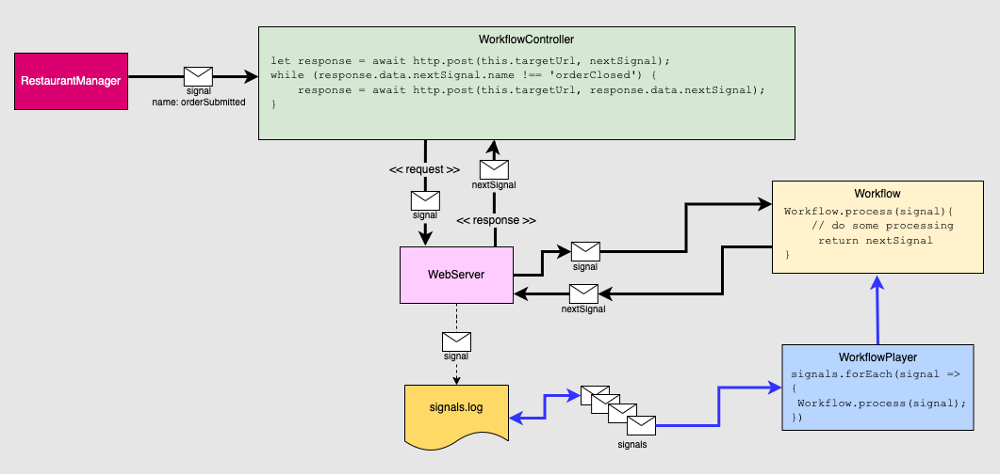

# Terrific Tacos
A project, written in TypeScript, demonstrates the concepts behind event sourcing.

Event sourcing is a software architectural pattern that is particularly appropriate to use in the context of complex and distributed systems. The pattern captures and stores all changes to an application's state as a sequence of immutable events.

- [Installing the packages](#installing-the-packages)
- [Running the project](h#running-the-project)
- [Be advised](#be-advised)
- [Understanding the use case](#understanding-the-use-case)
- [Understanding the architecture](#understanding-the-architecture)
- [Supporting event sourcing](#supporting-event-sourcing)

# Installing the packages

The project requires a computer or virtual machine that has Node.JS 18+ installed.

Install node

```bash
# Locally in your project.
npm install -D typescript
npm install -D ts-node
# Or globally with TypeScript.
npm install -g typescript
npm install -g ts-node
# Depending on configuration, you may also need these
npm install -D tslib @types/node
```

```bash
npm install
```

# Running the project

To run the bash script that executes the Event Sourcing demonstration project, execute the following command:

```bash
sh runScenario.sh
```

The bash script sends signals (a.k.a. *events*) into the project's web server. A signal represents a step in the demonstration application's workflow process. The web server stores the signal and forwards it onto the workflow which executes the step corresponding to the submitted signal. Also, after the bash script is done submitting signals to the workflow, the script then replays the workflow by resubmitting the signals orginally stored by the web server.

# Be advised

This project is a very simple demonstration of the essentials of event sourcing. Production grade support for event sourcing requires complex technology that goes well beyond the basics used in this demonstration project. This project does not address complexities such as coordinating replay behavior with ongoing signal storage and processing or supporting concurrency when millions of workflows are executing.

Typically, systems that support event sourcing at a production level use some type of message broker to manage messages as well as a framework to support concurrency. [Temporal](https://docs.temporal.io/) and [Akka](https://doc.akka.io/docs/akka/current/typed/persistence.html) for Java and Scala are good examples of production grade technologies that support event sourcing at scale.

# Understanding the use case

The use case that this project emulates is one in which a restaurant chain processes orders for each unit in a centralized manner. The restaurant chain is called *Terrific Tacos*.

The sequence of steps in the order process is:

- `orderSubmitted`
- `orderStarted`
- `orderReady`
- `orderServed`
- `paymentStarted`
- `paymentComplete`
- `orderClosed`

Steps are instigated via signals (a.k.a. *events*) submitted to the WebServer. The WebServer is acting as a very primitive message queue.

# Understanding the architecture

The illustration below describes the architecture and the signal dynamics.



A [signal](./src/model/ISignal.ts) that describes an [Order](./src/model/Order.ts) is passed to a component called a [WorkflowController](./src/WorkflowController.ts). The signal has a property called `name` which indicates the step to which the signal applies.

The WorkflowController passes the signal onto the system's [WebServer](./src/WebServer.ts). The WebServer passes the signal on to a component called a [Workflow](./src/Workflow.ts). The Workflow processes the Workflow steps according to the `name` property of the signal. The following is an example of the signal that starts the Workflow process. Notice that the value of the `name` property of the signal is `orderSubmitted`.


```json
{
    "id": null,
        "name": "orderSubmitted",
        "timeStamp": null,
        "order": {
        "orderItems": [
            {
                "description": "Cheese Quesadilla",
                "price": 6.99,
                "quantity": 7
            },
            {
                "description": "Breakfast Burrito",
                "price": 9.99,
                "quantity": 3
            }
        ],
            "customer": {
            "firstName": "Eriberto",
                "lastName": "Runte",
                "email": "Eriberto.Runte@email.com"
        },
        "creditCard": {
            "firstName": "Eriberto",
                "lastName": "Runte",
                "number": "4541511651043665"
        },
        "id": "d86f3d21-c14e-4fd6-9253-fd13f6b0bb29"
    },
    "restaurant": "Terrific Taco Number 1"
}
```

The [Workflow](./src/Workflow.ts) has a set of [handler functions](https://github.com/reselbob/TerrificTacos/blob/ba8303b83f4ccdf806b1a766e5069b46f7bafa7d/src/Workflow.ts#L5) that correspond to the various signals. A handler function takes a signal as a parameter. When a handler completes is processing, it returns the next signal to be used in the workflow process. This is very similar to the use of  [HATEOAS](https://en.wikipedia.org/wiki/HATEOAS) (Hypertext as the Engine of Application State) in a RESTful API, in that the `nextSignal` response makes the workflow self-describing in terms of how the workflow progresses.

The returned `nextSignal` is then returned by the WebController to the WebServer. The WebServer returns the `nextSignal` to the calling request as an HTTP response. The `nextSignal` can then be resubmitted to the WebServer to continue the logic of the workflow process.

The [RestaurantManager](./src/RestaurantManager.ts) component does the work of creating 3 orders, submitting each to a distinct workflow by way of an HTTP POST request to the WebServer. Each order is dedicated to a specific customer created at random. Also, each order is dedicated to a specific store that is part of the restaurant chain.

# Supporting event sourcing

As mentioned at the beginning of this readme, the purpose of the use case is to demonstrate [event sourcing](https://en.wikipedia.org/wiki/Domain-driven_design#Event_sourcing). Thus, this project is dividing into two parts. The first part is the one described above which has to do with executing the use case process using the WebServer, WorkflowController and Workflow.

The second part pertains to replaying the signals (a.k.a *events*) that instigate the various steps in the workflow. Replay is a core feature for systems that use event sourcing. In a system that supports event sourcing, events are stored in some sort of data storage mechanism. That data represents the state of the system over its lifetime and at any point in the system's operation.

Signal replay is conducted by the [WorkflowPlayer](/src/WorkflowPlayer.ts). The WorkflowPlayer retrieves the signals that have been recorded and stored by the WebServer in a file named `signals.log`. The file `signals.log` is in the `./data` directory which is created on the fly when the WebServer starts receiving signals. (The WebServer is the sole component that does the work of storing signal data in the `signals.log` file.)

The WorkflowPlayer component retrieves the data stored in the `signals.log` file. The WorkflowPlayer then parses the data in the file into signals. These signals are then submitted to the `Workflow` component. Submitting the signals to the `Workflow` replicates the `Workflow`s behavior.

The output below is example of the result of running the WorkflowPlayer:

```text

info: Order 4086025f-de44-4af5-8211-0b828c697c02 for restaurant Terrific Taco Number 1 has been submitted.
info: Order 4086025f-de44-4af5-8211-0b828c697c02 for restaurant Terrific Taco Number 1 has started to be made.
info: Order 4086025f-de44-4af5-8211-0b828c697c02 for restaurant Terrific Taco Number 1 is ready.
info: The order {"orderItems":[{"description":"Tamale","price":3.99,"quantity":7},{"description":"Big Chicken Taco","price":4.99,"quantity":7}],"customer":{"firstName":"Oswald","lastName":"Ward","email":"Oswald.Ward@email.com"},"creditCard":{"firstName":"Oswald","lastName":"Ward","number":"4645204777159415"},"id":"4086025f-de44-4af5-8211-0b828c697c02"} for restaurant Terrific Taco Number 1 has been served.
info: The order {"orderItems":[{"description":"Tamale","price":3.99,"quantity":7},{"description":"Big Chicken Taco","price":4.99,"quantity":7}],"customer":{"firstName":"Oswald","lastName":"Ward","email":"Oswald.Ward@email.com"},"creditCard":{"firstName":"Oswald","lastName":"Ward","number":"4645204777159415"},"id":"4086025f-de44-4af5-8211-0b828c697c02"} for restaurant Terrific Taco Number 1 for the amount of 62.86 has started payment process using credit card {"firstName":"Oswald","lastName":"Ward","number":"4645204777159415"}.
info: The customer {"firstName":"Oswald","lastName":"Ward","email":"Oswald.Ward@email.com"} has paid. The customer is free to leave Terrific Taco Number 1
info: Order 2cdff31b-27b1-4130-a777-9b59efe19d90 for restaurant Terrific Taco Number 2 has been submitted.
info: Order 2cdff31b-27b1-4130-a777-9b59efe19d90 for restaurant Terrific Taco Number 2 has started to be made.
info: Order 2cdff31b-27b1-4130-a777-9b59efe19d90 for restaurant Terrific Taco Number 2 is ready.
info: The order {"orderItems":[{"description":"Big Chicken Taco","price":4.99,"quantity":4},{"description":"Breakfast Burrito","price":9.99,"quantity":9},{"description":"Cheese Quesadilla","price":6.99,"quantity":1}],"customer":{"firstName":"Eli","lastName":"Sipes","email":"Eli.Sipes@email.com"},"creditCard":{"firstName":"Eli","lastName":"Sipes","number":"4483860763073832"},"id":"2cdff31b-27b1-4130-a777-9b59efe19d90"} for restaurant Terrific Taco Number 2 has been served.
info: The order {"orderItems":[{"description":"Big Chicken Taco","price":4.99,"quantity":4},{"description":"Breakfast Burrito","price":9.99,"quantity":9},{"description":"Cheese Quesadilla","price":6.99,"quantity":1}],"customer":{"firstName":"Eli","lastName":"Sipes","email":"Eli.Sipes@email.com"},"creditCard":{"firstName":"Eli","lastName":"Sipes","number":"4483860763073832"},"id":"2cdff31b-27b1-4130-a777-9b59efe19d90"} for restaurant Terrific Taco Number 2 for the amount of 116.86 has started payment process using credit card {"firstName":"Eli","lastName":"Sipes","number":"4483860763073832"}.
info: The customer {"firstName":"Eli","lastName":"Sipes","email":"Eli.Sipes@email.com"} has paid. The customer is free to leave Terrific Taco Number 2
info: Order 33227428-8ea6-436f-ae08-504ee12ba881 for restaurant Terrific Taco Number 3 has been submitted.
info: Order 33227428-8ea6-436f-ae08-504ee12ba881 for restaurant Terrific Taco Number 3 has started to be made.
info: Order 33227428-8ea6-436f-ae08-504ee12ba881 for restaurant Terrific Taco Number 3 is ready.
info: The order {"orderItems":[{"description":"Breakfast Burrito","price":9.99,"quantity":6}],"customer":{"firstName":"Hilton","lastName":"Veum","email":"Hilton.Veum@email.com"},"creditCard":{"firstName":"Hilton","lastName":"Veum","number":"4859030983839535"},"id":"33227428-8ea6-436f-ae08-504ee12ba881"} for restaurant Terrific Taco Number 3 has been served.
info: The order {"orderItems":[{"description":"Breakfast Burrito","price":9.99,"quantity":6}],"customer":{"firstName":"Hilton","lastName":"Veum","email":"Hilton.Veum@email.com"},"creditCard":{"firstName":"Hilton","lastName":"Veum","number":"4859030983839535"},"id":"33227428-8ea6-436f-ae08-504ee12ba881"} for restaurant Terrific Taco Number 3 for the amount of 59.94 has started payment process using credit card {"firstName":"Hilton","lastName":"Veum","number":"4859030983839535"}.
info: The customer {"firstName":"Hilton","lastName":"Veum","email":"Hilton.Veum@email.com"} has paid. The customer is free to leave Terrific Taco Number 3
info: Order 841d2135-c448-4676-8a9f-d0c92af81a18 for restaurant Terrific Taco Number 1 has been submitted.
info: Order 841d2135-c448-4676-8a9f-d0c92af81a18 for restaurant Terrific Taco Number 1 has started to be made.
info: Order 841d2135-c448-4676-8a9f-d0c92af81a18 for restaurant Terrific Taco Number 1 is ready.
info: The order {"orderItems":[{"description":"Big Chicken Taco","price":4.99,"quantity":7},{"description":"Big Fish Taco","price":4.99,"quantity":9}],"customer":{"firstName":"Chadrick","lastName":"McDermott","email":"Chadrick.McDermott@email.com"},"creditCard":{"firstName":"Chadrick","lastName":"McDermott","number":"4140277528631587"},"id":"841d2135-c448-4676-8a9f-d0c92af81a18"} for restaurant Terrific Taco Number 1 has been served.
info: The order {"orderItems":[{"description":"Big Chicken Taco","price":4.99,"quantity":7},{"description":"Big Fish Taco","price":4.99,"quantity":9}],"customer":{"firstName":"Chadrick","lastName":"McDermott","email":"Chadrick.McDermott@email.com"},"creditCard":{"firstName":"Chadrick","lastName":"McDermott","number":"4140277528631587"},"id":"841d2135-c448-4676-8a9f-d0c92af81a18"} for restaurant Terrific Taco Number 1 for the amount of 79.84 has started payment process using credit card {"firstName":"Chadrick","lastName":"McDermott","number":"4140277528631587"}.
info: The customer {"firstName":"Chadrick","lastName":"McDermott","email":"Chadrick.McDermott@email.com"} has paid. The customer is free to leave Terrific Taco Number 1
info: Order 24b2e848-d1cd-44a0-8fee-20ab9b9d8299 for restaurant Terrific Taco Number 2 has been submitted.
info: Order 24b2e848-d1cd-44a0-8fee-20ab9b9d8299 for restaurant Terrific Taco Number 2 has started to be made.
info: Order 24b2e848-d1cd-44a0-8fee-20ab9b9d8299 for restaurant Terrific Taco Number 2 is ready.
info: The order {"orderItems":[{"description":"Little Fish Taco","price":1.99,"quantity":7},{"description":"Big Fish Taco","price":4.99,"quantity":9},{"description":"Little Fish Taco","price":1.99,"quantity":10}],"customer":{"firstName":"Skyla","lastName":"Tromp","email":"Skyla.Tromp@email.com"},"creditCard":{"firstName":"Skyla","lastName":"Tromp","number":"4243790357986472"},"id":"24b2e848-d1cd-44a0-8fee-20ab9b9d8299"} for restaurant Terrific Taco Number 2 has been served.
info: The order {"orderItems":[{"description":"Little Fish Taco","price":1.99,"quantity":7},{"description":"Big Fish Taco","price":4.99,"quantity":9},{"description":"Little Fish Taco","price":1.99,"quantity":10}],"customer":{"firstName":"Skyla","lastName":"Tromp","email":"Skyla.Tromp@email.com"},"creditCard":{"firstName":"Skyla","lastName":"Tromp","number":"4243790357986472"},"id":"24b2e848-d1cd-44a0-8fee-20ab9b9d8299"} for restaurant Terrific Taco Number 2 for the amount of 78.74000000000001 has started payment process using credit card {"firstName":"Skyla","lastName":"Tromp","number":"4243790357986472"}.
info: The customer {"firstName":"Skyla","lastName":"Tromp","email":"Skyla.Tromp@email.com"} has paid. The customer is free to leave Terrific Taco Number 2
info: Order bf1d2f62-d076-4049-ad77-ac0eff001c59 for restaurant Terrific Taco Number 3 has been submitted.
info: Order bf1d2f62-d076-4049-ad77-ac0eff001c59 for restaurant Terrific Taco Number 3 has started to be made.
info: Order bf1d2f62-d076-4049-ad77-ac0eff001c59 for restaurant Terrific Taco Number 3 is ready.
info: The order {"orderItems":[{"description":"Big Fish Taco","price":4.99,"quantity":2}],"customer":{"firstName":"Alayna","lastName":"Bahringer","email":"Alayna.Bahringer@email.com"},"creditCard":{"firstName":"Alayna","lastName":"Bahringer","number":"4843096819895324"},"id":"bf1d2f62-d076-4049-ad77-ac0eff001c59"} for restaurant Terrific Taco Number 3 has been served.
info: The order {"orderItems":[{"description":"Big Fish Taco","price":4.99,"quantity":2}],"customer":{"firstName":"Alayna","lastName":"Bahringer","email":"Alayna.Bahringer@email.com"},"creditCard":{"firstName":"Alayna","lastName":"Bahringer","number":"4843096819895324"},"id":"bf1d2f62-d076-4049-ad77-ac0eff001c59"} for restaurant Terrific Taco Number 3 for the amount of 9.98 has started payment process using credit card {"firstName":"Alayna","lastName":"Bahringer","number":"4843096819895324"}.
info: The customer {"firstName":"Alayna","lastName":"Bahringer","email":"Alayna.Bahringer@email.com"} has paid. The customer is free to leave Terrific Taco Number 3
info: Order 6e8cece1-9c92-4302-bdd7-edea47efb52e for restaurant Terrific Taco Number 1 has been submitted.
info: Order 6e8cece1-9c92-4302-bdd7-edea47efb52e for restaurant Terrific Taco Number 1 has started to be made.
info: Order 6e8cece1-9c92-4302-bdd7-edea47efb52e for restaurant Terrific Taco Number 1 is ready.
info: The order {"orderItems":[{"description":"Big Fish Taco","price":4.99,"quantity":1},{"description":"Cheese Quesadilla","price":6.99,"quantity":10}],"customer":{"firstName":"Otha","lastName":"Quigley","email":"Otha.Quigley@email.com"},"creditCard":{"firstName":"Otha","lastName":"Quigley","number":"4398655989101439"},"id":"6e8cece1-9c92-4302-bdd7-edea47efb52e"} for restaurant Terrific Taco Number 1 has been served.
info: The order {"orderItems":[{"description":"Big Fish Taco","price":4.99,"quantity":1},{"description":"Cheese Quesadilla","price":6.99,"quantity":10}],"customer":{"firstName":"Otha","lastName":"Quigley","email":"Otha.Quigley@email.com"},"creditCard":{"firstName":"Otha","lastName":"Quigley","number":"4398655989101439"},"id":"6e8cece1-9c92-4302-bdd7-edea47efb52e"} for restaurant Terrific Taco Number 1 for the amount of 74.89 has started payment process using credit card {"firstName":"Otha","lastName":"Quigley","number":"4398655989101439"}.
info: The customer {"firstName":"Otha","lastName":"Quigley","email":"Otha.Quigley@email.com"} has paid. The customer is free to leave Terrific Taco Number 1
info: Order a48d3110-1f08-4101-afef-ed419be2befe for restaurant Terrific Taco Number 2 has been submitted.
info: Order a48d3110-1f08-4101-afef-ed419be2befe for restaurant Terrific Taco Number 2 has started to be made.
info: Order a48d3110-1f08-4101-afef-ed419be2befe for restaurant Terrific Taco Number 2 is ready.
info: The order {"orderItems":[{"description":"Cheese Quesadilla","price":6.99,"quantity":4},{"description":"Little Fish Taco","price":1.99,"quantity":5},{"description":"Tamale","price":3.99,"quantity":6}],"customer":{"firstName":"Brian","lastName":"Abernathy","email":"Brian.Abernathy@email.com"},"creditCard":{"firstName":"Brian","lastName":"Abernathy","number":"4558983100876020"},"id":"a48d3110-1f08-4101-afef-ed419be2befe"} for restaurant Terrific Taco Number 2 has been served.
info: The order {"orderItems":[{"description":"Cheese Quesadilla","price":6.99,"quantity":4},{"description":"Little Fish Taco","price":1.99,"quantity":5},{"description":"Tamale","price":3.99,"quantity":6}],"customer":{"firstName":"Brian","lastName":"Abernathy","email":"Brian.Abernathy@email.com"},"creditCard":{"firstName":"Brian","lastName":"Abernathy","number":"4558983100876020"},"id":"a48d3110-1f08-4101-afef-ed419be2befe"} for restaurant Terrific Taco Number 2 for the amount of 61.849999999999994 has started payment process using credit card {"firstName":"Brian","lastName":"Abernathy","number":"4558983100876020"}.
info: The customer {"firstName":"Brian","lastName":"Abernathy","email":"Brian.Abernathy@email.com"} has paid. The customer is free to leave Terrific Taco Number 2
info: Order 7b788238-c29d-4c71-97f7-f9091fcd2a9a for restaurant Terrific Taco Number 3 has been submitted.
info: Order 7b788238-c29d-4c71-97f7-f9091fcd2a9a for restaurant Terrific Taco Number 3 has started to be made.
info: Order 7b788238-c29d-4c71-97f7-f9091fcd2a9a for restaurant Terrific Taco Number 3 is ready.
info: The order {"orderItems":[{"description":"Big Fish Taco","price":4.99,"quantity":7}],"customer":{"firstName":"Jerome","lastName":"Grady","email":"Jerome.Grady@email.com"},"creditCard":{"firstName":"Jerome","lastName":"Grady","number":"4985112091678909"},"id":"7b788238-c29d-4c71-97f7-f9091fcd2a9a"} for restaurant Terrific Taco Number 3 has been served.
info: The order {"orderItems":[{"description":"Big Fish Taco","price":4.99,"quantity":7}],"customer":{"firstName":"Jerome","lastName":"Grady","email":"Jerome.Grady@email.com"},"creditCard":{"firstName":"Jerome","lastName":"Grady","number":"4985112091678909"},"id":"7b788238-c29d-4c71-97f7-f9091fcd2a9a"} for restaurant Terrific Taco Number 3 for the amount of 34.93 has started payment process using credit card {"firstName":"Jerome","lastName":"Grady","number":"4985112091678909"}.
info: The customer {"firstName":"Jerome","lastName":"Grady","email":"Jerome.Grady@email.com"} has paid. The customer is free to leave Terrific Taco Number 3
info: Order 3e9a019b-7a70-42ca-9648-8b83e663698e for restaurant Terrific Taco Number 1 has been submitted.
info: Order 3e9a019b-7a70-42ca-9648-8b83e663698e for restaurant Terrific Taco Number 1 has started to be made.
info: Order 3e9a019b-7a70-42ca-9648-8b83e663698e for restaurant Terrific Taco Number 1 is ready.
info: The order {"orderItems":[{"description":"Tamale","price":3.99,"quantity":8},{"description":"Big Fish Taco","price":4.99,"quantity":7}],"customer":{"firstName":"Devyn","lastName":"Prohaska","email":"Devyn.Prohaska@email.com"},"creditCard":{"firstName":"Devyn","lastName":"Prohaska","number":"4018343421436676"},"id":"3e9a019b-7a70-42ca-9648-8b83e663698e"} for restaurant Terrific Taco Number 1 has been served.
info: The order {"orderItems":[{"description":"Tamale","price":3.99,"quantity":8},{"description":"Big Fish Taco","price":4.99,"quantity":7}],"customer":{"firstName":"Devyn","lastName":"Prohaska","email":"Devyn.Prohaska@email.com"},"creditCard":{"firstName":"Devyn","lastName":"Prohaska","number":"4018343421436676"},"id":"3e9a019b-7a70-42ca-9648-8b83e663698e"} for restaurant Terrific Taco Number 1 for the amount of 66.85 has started payment process using credit card {"firstName":"Devyn","lastName":"Prohaska","number":"4018343421436676"}.
info: The customer {"firstName":"Devyn","lastName":"Prohaska","email":"Devyn.Prohaska@email.com"} has paid. The customer is free to leave Terrific Taco Number 1
info: Order 1ce40951-0f5d-4da7-a8e7-8161c9c38a03 for restaurant Terrific Taco Number 2 has been submitted.
info: Order 1ce40951-0f5d-4da7-a8e7-8161c9c38a03 for restaurant Terrific Taco Number 2 has started to be made.
info: Order 1ce40951-0f5d-4da7-a8e7-8161c9c38a03 for restaurant Terrific Taco Number 2 is ready.
info: The order {"orderItems":[{"description":"Big Chicken Taco","price":4.99,"quantity":8},{"description":"Tamale","price":3.99,"quantity":2},{"description":"Cheese Quesadilla","price":6.99,"quantity":5}],"customer":{"firstName":"Alisha","lastName":"Hodkiewicz","email":"Alisha.Hodkiewicz@email.com"},"creditCard":{"firstName":"Alisha","lastName":"Hodkiewicz","number":"4471013334506030"},"id":"1ce40951-0f5d-4da7-a8e7-8161c9c38a03"} for restaurant Terrific Taco Number 2 has been served.
info: The order {"orderItems":[{"description":"Big Chicken Taco","price":4.99,"quantity":8},{"description":"Tamale","price":3.99,"quantity":2},{"description":"Cheese Quesadilla","price":6.99,"quantity":5}],"customer":{"firstName":"Alisha","lastName":"Hodkiewicz","email":"Alisha.Hodkiewicz@email.com"},"creditCard":{"firstName":"Alisha","lastName":"Hodkiewicz","number":"4471013334506030"},"id":"1ce40951-0f5d-4da7-a8e7-8161c9c38a03"} for restaurant Terrific Taco Number 2 for the amount of 82.85000000000001 has started payment process using credit card {"firstName":"Alisha","lastName":"Hodkiewicz","number":"4471013334506030"}.
info: The customer {"firstName":"Alisha","lastName":"Hodkiewicz","email":"Alisha.Hodkiewicz@email.com"} has paid. The customer is free to leave Terrific Taco Number 2
info: Order bf484020-c237-4e1b-b40b-f32eb1db77c9 for restaurant Terrific Taco Number 3 has been submitted.
info: Order bf484020-c237-4e1b-b40b-f32eb1db77c9 for restaurant Terrific Taco Number 3 has started to be made.
info: Order bf484020-c237-4e1b-b40b-f32eb1db77c9 for restaurant Terrific Taco Number 3 is ready.
info: The order {"orderItems":[{"description":"Breakfast Burrito","price":9.99,"quantity":6}],"customer":{"firstName":"Zelda","lastName":"Rutherford","email":"Zelda.Rutherford@email.com"},"creditCard":{"firstName":"Zelda","lastName":"Rutherford","number":"4216443980210204"},"id":"bf484020-c237-4e1b-b40b-f32eb1db77c9"} for restaurant Terrific Taco Number 3 has been served.
info: The order {"orderItems":[{"description":"Breakfast Burrito","price":9.99,"quantity":6}],"customer":{"firstName":"Zelda","lastName":"Rutherford","email":"Zelda.Rutherford@email.com"},"creditCard":{"firstName":"Zelda","lastName":"Rutherford","number":"4216443980210204"},"id":"bf484020-c237-4e1b-b40b-f32eb1db77c9"} for restaurant Terrific Taco Number 3 for the amount of 59.94 has started payment process using credit card {"firstName":"Zelda","lastName":"Rutherford","number":"4216443980210204"}.
info: The customer {"firstName":"Zelda","lastName":"Rutherford","email":"Zelda.Rutherford@email.com"} has paid. The customer is free to leave Terrific Taco Number 3
```


